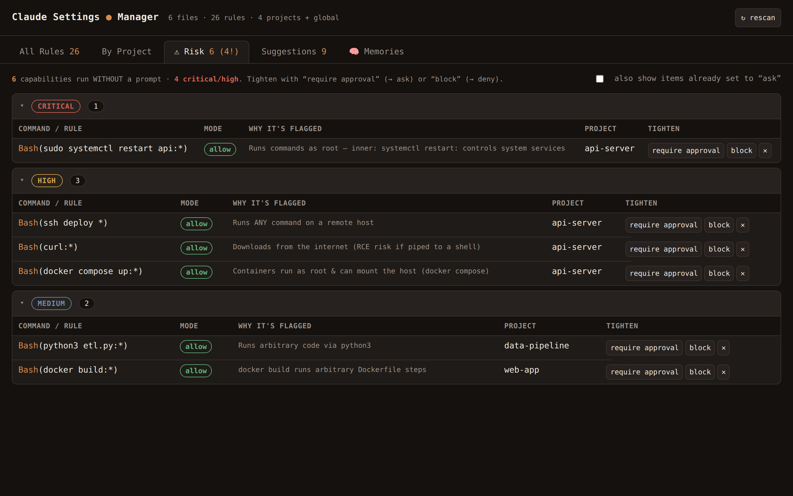
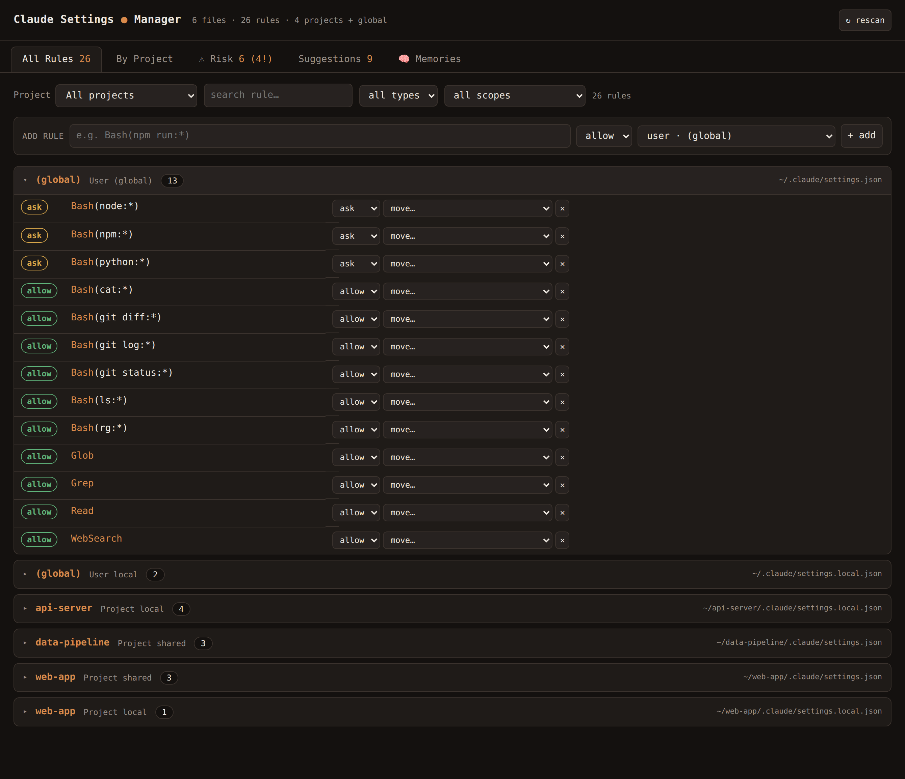
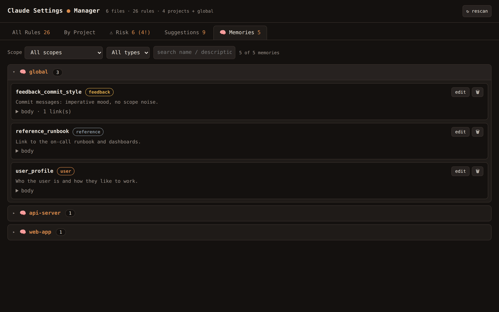

# Claude Settings Manager

**Audit, consolidate, and safely edit your Claude Code permission rules across every settings file — in one local web app.**

Claude Code reads permissions from a whole hierarchy of files: your global `~/.claude/settings.json`, a machine-local `~/.claude/settings.local.json`, and a shared **+** local pair inside every project's `.claude/` directory (plus enterprise-managed settings). Once you have a handful of projects, you end up with a dozen-plus files and hundreds of `allow`/`ask`/`deny` rules, with no way to see them all at once, spot duplicates, or notice that something dangerous is auto-approved.

This tool gives you that single pane of glass — and lets you fix things, with every change **staged and confirmed before anything is written to disk**.

- 🐍 **Zero dependencies** — pure Python standard library + vanilla JS. No `pip install`, no `npm`, no build step.
- 🔒 **Local only** — binds to `127.0.0.1`, reads/writes only your own settings files.
- 💾 **Safe by default** — nothing is written until you click **Apply**; every file is backed up first.



> *The ⚠ Risk tab flags every capability that runs **without a prompt** — `sudo`, remote `ssh`, `curl`, `docker`, … — grouped by severity, with one-click "require approval" or "block".*

---

## Quick start

```bash
git clone https://github.com/Usimian/claude-settings-manager.git
cd claude-settings-manager
./start.sh                    # serves http://127.0.0.1:8787, scans your home dir
```

Open <http://127.0.0.1:8787>. That's it — no install.

```bash
./start.sh --port 9000        # use a different port
./start.sh --root /path/to/dir # scan a different tree for project .claude dirs
```

Requires Python 3.8+. Tested on Linux; should work anywhere Python + a browser run.

---

## What it does

### 🗂 All Rules
Every permission rule from every file in one place, organized by a **Project** dropdown and collapsed into per-file groups (so it's scannable even with hundreds of rules). Filter by text, type, scope, or project. Per-rule actions: change type (`allow` ↔ `ask` ↔ `deny`), move/promote to another file, or delete — plus an add-rule form.



### 🧭 By Project
The **effective merged ruleset** each project actually sees (its own rules **+** all global rules), ordered `deny → ask → allow`. Type a rule (e.g. `WebSearch`) to see exactly how it resolves in each project, with rules that are shadowed by a broader one greyed out. Each row is tagged with where it came from (`global` vs `this project`).

### ⚠ Risk
The headline safety view: **"what can run without asking me, and could it hurt?"** A classifier scans every rule and flags destructive / privileged / remote / arbitrary-exec capabilities (`rm`, `sudo`, `dd`, `curl`, force-push, `docker run`, shell/interpreter access, …), grouped by severity. It understands wrappers — `sudo rm` is **critical**, but `ssh host cat` is correctly **low**. One click to **require approval** (→ `ask`) or **block** (→ `deny`).

### 💡 Suggestions
Automated cleanup, each with a one-click (staged) fix:
- **conflict / overridden-allow** — a rule that never applies because a higher-precedence rule covers it (e.g. `allow Bash(env)` is dead under `ask Bash(env:*)`).
- **promote-to-global** — a rule duplicated across several projects → lift it to `~/.claude/settings.json` and drop the copies.
- **shadowed / duplicate** — redundant rules covered by a broader one.
- **ask labels** — every `ask` rule tagged as an active **guardrail** (it overrides an `allow`) or **redundant** under the default mode.
- **local-only** — rules that live only in `*.local.json` (personal, not shared).

### 🧠 Memories
Browse and edit Claude Code's [auto-memory](https://code.claude.com/docs/en/memory) files across every scope (your global `~/.claude/projects/.../memory/` and each project's). Filter by scope, type (`user`/`feedback`/`project`/`reference`), or full-text search; expand to read the body and follow `[[links]]`. Edit description/type/body inline or delete — staged like everything else, and a delete also removes the matching line from that scope's `MEMORY.md` index.



---

## How Claude Code permissions actually work

A quick primer, since the tool's views lean on it:

**Three outcomes:** `allow` (runs with no prompt) · `ask` (prompts you) · `deny` (blocked).

**Precedence when more than one rule matches:** `deny > ask > allow` — *most restrictive wins.* So `ask` is **not** the weakest level; an `ask` rule overrides an `allow`. That's what makes `ask` useful as a guardrail.

**Default when nothing matches:** Claude Code prompts you.

**File precedence** (for single-value settings, highest wins):
`managed > project-local > project-shared > user-local > user`.
Permission **rule arrays** are unioned across all files, then evaluated `deny → ask → allow`.

**`settings.json` vs `settings.local.json`:** the non-`local` file is your deliberate, shareable config (commit it); the `*.local.json` file is machine-local and is where "always allow" appends rules (gitignored).

---

## Safety

- **Nothing is written until you click Apply.** Edits stage in the UI (with undo); a confirmation lists every change before it's committed.
- **Every modified file is backed up** to `settings.json.bak-YYYYMMDD-HHMMSS` first.
- **Only the `permissions` arrays are touched** — `model`, `hooks`, `env`, `statusLine`, and every other key are preserved exactly.
- Claude Code hot-reloads settings, so changes take effect without a restart.

---

## How it works

- `server.py` — a stdlib `http.server` that discovers settings files, parses rules, computes the merge/coverage/risk/suggestion analyses, and serves a small JSON API. The only write path is a single batched `/api/apply` endpoint.
- `index.html` — a single-page vanilla-JS frontend (no framework, no bundler).

No telemetry, no network calls, no external services.

---

## Security model & limitations

The server **binds to `127.0.0.1` only** and is meant for a single local user. Within that boundary it still defends itself:

- **Writes are confined to the scanned root** — an op targeting a path outside it is refused (no writing to `/etc/...`).
- **Cross-origin and DNS-rebinding protection** — POSTs with a foreign `Origin`, or requests with a non-localhost `Host`, are rejected (403), so a malicious web page in your browser can't drive the server.
- **Rule types are validated** (`allow`/`ask`/`deny` only) and backups are uniquely named.

Known limitations, by design:

- **The danger classifier is a heuristic denylist**, not a security guarantee. It flags *known* risky command patterns; a novel or deliberately obfuscated command (e.g. a dangerous payload hidden inside `bash -c "…"`) may show as benign. Use it as a spotlight, not a sandbox.
- It serves only the single self-contained `index.html` (no static-file server), so a favicon request 404s — harmless.
- No authentication beyond the localhost/origin checks above: anyone who can reach `127.0.0.1` on your machine can use it.

---

## Testing

A zero-dependency test suite covers parsing, discovery, the coverage/danger/suggestion logic, every write path (with backups + key preservation), and the full memory lifecycle:

```bash
python3 test_app.py            # 33 tests, stdlib unittest only
```

---

## Contributing

Issues and PRs welcome. The danger classifier (`classify_command` in `server.py`) is intentionally easy to extend — add a command pattern and a severity. Ideas: more cleanup heuristics, an effective-mode simulator, export/diff of a settings set.

---

## License

[MIT](LICENSE) © Marc Wester
